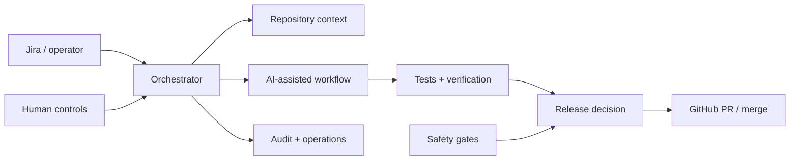

# AI Dev Orchestrator

An experimental control plane for **AI-assisted software development workflows** — connecting work intake, repository context, coding workflows, GitHub operations, verification, release decisions, and human controls.

The project explores a practical question: **what engineering system needs to exist around coding agents before they can safely participate in real software delivery?**

> **Current state:** 18 implementation phases completed. The system has progressed from a basic Jira-to-workflow backbone to repository onboarding, guarded GitHub automation, operational controls, project activation, and first-use safety mechanisms.

[Project overview on suyogjoshi.com →](https://suyogjoshi.com/systems/ai-dev-orchestrator/)

## System at a Glance



The orchestrator is deliberately more than a prompt runner. It maintains workflow state, repository knowledge, operational controls, safety gates, evidence, and human boundaries around AI-assisted changes.

## What It Does

### Work intake and orchestration

- Receives Jira webhook events and maps work to repositories.
- Persists workflow state in PostgreSQL.
- Uses Redis-backed queues and workers for asynchronous execution.
- Supports clarification and operator interaction through Telegram and admin interfaces.

### Repository onboarding and context

- Detects repository capability profiles and validation commands.
- Generates repository structure, architecture, and coding-convention knowledge snapshots.
- Supports per-repository command overrides when automatic detection is insufficient.
- Refreshes project knowledge without discarding operator-configured repository settings.

### AI-assisted engineering workflow

- Dispatches structured implementation workflows rather than unconstrained agent runs.
- Connects repository context, task state, validation, and release decisions.
- Supports project bootstrap flows for selected project types.
- Can manage external projects and has been dogfooded against its own repository.

### GitHub and release controls

- Guards GitHub write operations such as push, PR creation, and merge.
- Checks repository branch protection.
- Uses explicit release decisions rather than assuming successful agent execution means "done."
- Supports first-use mode so the first N successful changes require manual review before auto-merge can engage.
- Permanently blocks automatic self-merge when the orchestrator is modifying its own repository.

### Operational and security controls

- Admin API authentication and Jira webhook validation.
- Telegram chat enforcement and Redis-backed rate limiting.
- Runtime pause/resume without redeployment.
- Append-only security-event logging and operational audit trails.
- Project activation checks before a repository is allowed into normal orchestration.

## Safety Model

AI automation is treated as a controlled participant in the delivery system, not as an independent authority.

```text
Repository onboarded
        ↓
Project activated
        ↓
Context + capability profile established
        ↓
AI-assisted workflow executes
        ↓
Tests / checks / review evidence
        ↓
Release decision
        ↓
Human or automated merge, subject to safety gates
```

Important guardrails include:

- **Pause control** — orchestration can be stopped at runtime.
- **GitHub write guard** — repository writes can be disabled independently of workflow execution.
- **First-use mode** — early changes for a newly onboarded repository require manual review.
- **Self-modification guard** — the orchestrator cannot auto-merge changes to itself.
- **Branch-protection checks** — repository controls are inspected before normal automation.
- **Audit events** — important security and control events are recorded for later inspection.

## Technology

The current implementation uses:

- **Python / FastAPI** — orchestration service and admin APIs
- **PostgreSQL** — workflow, project, control, and audit state
- **Redis** — queues and rate limiting
- **Docker / Docker Compose** — local runtime
- **GitHub APIs** — repository operations and delivery controls
- **Jira** — work intake
- **Telegram** — notifications and operator interaction
- **Anthropic API** — AI-assisted repository analysis and workflow steps

## Quick Start

### Prerequisites

- Docker and Docker Compose
- Git
- Credentials for the external integrations you want to exercise

Clone the repository:

```bash
git clone https://github.com/suyog19/ai-dev-orchestrator.git
cd ai-dev-orchestrator
```

Create your local environment file:

```bash
cp .env.example .env
```

At minimum, review the values in `.env` before starting the system. External integrations require their corresponding credentials.

Start the application, PostgreSQL, Redis, and worker:

```bash
docker compose up --build
```

The API is exposed on:

```text
http://localhost:8000
```

A simple health check is available at:

```bash
curl http://localhost:8000/healthz
```

For real-project operation, see [Using the Orchestrator for Real Projects](docs/runbooks/using-orchestrator-for-real-projects.md).

## Repository Structure

```text
ai-dev-orchestrator/
├── app/                 # API, workflows, onboarding, security, UI, worker
├── config/              # Repository-specific configuration and hints
├── docs/
│   ├── phases/          # Implementation history and phase summaries
│   ├── runbooks/        # Operational procedures
│   └── security/        # Security and permission documentation
├── scripts/             # Operational and validation scripts
├── templates/           # Project/bootstrap templates
├── .env.example         # Runtime configuration reference
├── docker-compose.yml   # Local application + PostgreSQL + Redis + worker
└── Dockerfile
```

## Project History

The implementation evolved incrementally through 18 phases. The phase documents are retained as an engineering record of design decisions, gaps, validation results, and changes made along the way.

Useful starting points:

- [Phase 18 — Product Readiness & First Real Projects](docs/phases/PHASE18_SUMMARY.md)
- [Phase 11 — Control & Security Hardening](docs/phases/PHASE11_SUMMARY.md)
- [Phase implementation history](docs/phases/)
- [Operations runbook](docs/runbooks/using-orchestrator-for-real-projects.md)

## Project Status

This is an **experimental engineering system**, not a general-purpose hosted product. It is intended to explore patterns for controlled AI-assisted delivery: repository onboarding, context preparation, workflow orchestration, deterministic checks, operational controls, human gates, and safe progression toward greater automation.

The most important idea in the project is not autonomous code generation. It is the engineering structure around it.
